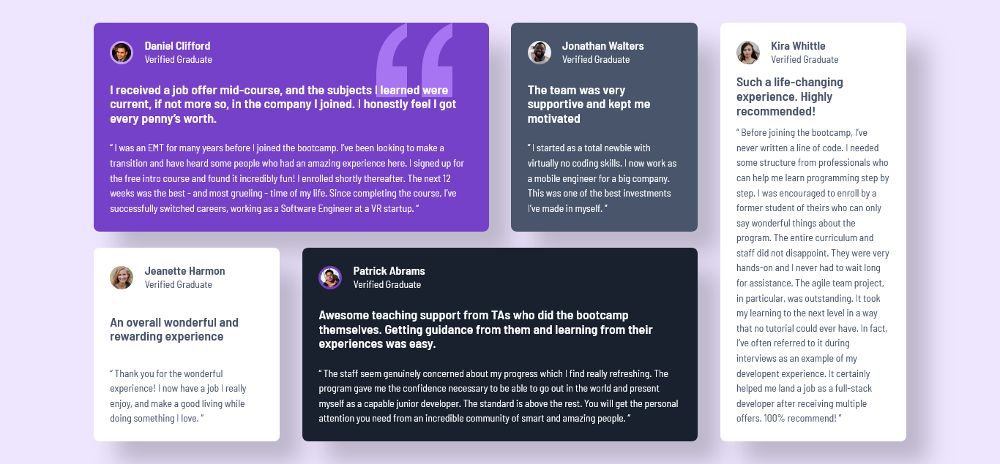

# Frontend Mentor - Solução da seção de depoimentos em grid

Esta é uma solução para o desafio **Testimonials Grid Section** do [Frontend Mentor](https://www.frontendmentor.io).  
Os desafios do Frontend Mentor ajudam você a melhorar suas habilidades de programação construindo projetos realistas.

---

## Sumário

- [Frontend Mentor - Solução da seção de depoimentos em grid](#frontend-mentor---solução-da-seção-de-depoimentos-em-grid)
  - [Sumário](#sumário)
  - [Visão geral](#visão-geral)
    - [Screenshot](#screenshot)
    - [Links](#links)
  - [Meu processo](#meu-processo)
    - [Construído com](#construído-com)
    - [O que aprendi](#o-que-aprendi)
    - [Desenvolvimento contínuo](#desenvolvimento-contínuo)
    - [Recursos úteis](#recursos-úteis)
  - [Autor](#autor)
  - [Agradecimentos](#agradecimentos)

---

## Visão geral

### Screenshot

---

### Links

- URL da solução: _(https://www.frontendmentor.io/solutions/testimonials-grid-section-wKqJ1gs72C)_
- URL do site ao vivo: _(https://lanzincode.github.io/testimonials-grid-section-main/)_

---

## Meu processo

### Construído com

- HTML5 semântico
- CSS Grid
- Flexbox (apoio estrutural)
- Propriedades personalizadas do CSS
- Abordagem desktop-first
- Design responsivo

---

### O que aprendi

Neste projeto, trabalhei na construção de uma **seção de depoimentos organizada em grid**, utilizando uma abordagem **desktop-first**, com foco em:

- Criação de layouts assimétricos e bem distribuídos
- Uso de CSS Grid para controle estrutural
- Organização visual de múltiplos cards
- Hierarquia tipográfica clara
- Combinação eficiente de Grid e Flexbox

Esse desafio foi importante para consolidar o uso de **CSS Grid em layouts editoriais e institucionais**.

---

### Desenvolvimento contínuo

Em projetos futuros, pretendo:

- Refinar ainda mais layouts baseados em grid
- Melhorar a responsividade a partir do desktop
- Criar padrões reutilizáveis para seções de conteúdo
- Evoluir a organização do CSS
- Aplicar melhorias de acessibilidade

---

### Recursos úteis

- MDN Web Docs – Referência essencial para HTML e CSS
- Frontend Mentor – Plataforma excelente para prática com projetos reais
- CSS-Tricks – Conteúdos aprofundados sobre CSS Grid e layout

---

## Autor

- GitHub – https://github.com/lanzincode
- Frontend Mentor – https://www.frontendmentor.io/profile/lanzincode

---

## Agradecimentos

Agradecimentos ao **Frontend Mentor** por disponibilizar desafios bem estruturados, ideais para praticar layouts modernos e aprofundar conhecimentos em CSS Grid.
